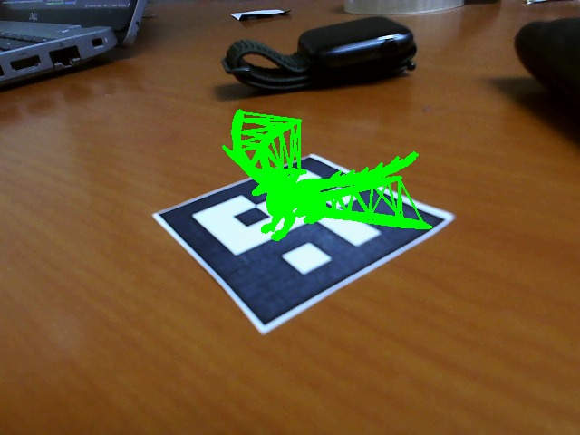

### Prerequisites
* Aruco Marker printouts of dictionary 4x4, 5x5 and 6x6. Tags should be numbered 1 to 4. Available in the PDF given

### Working
* Put videos required in a folder "video_files" 
* Run the code final2.py 
* Code uses occlusion to cycle through videos. Hover finger above the ArUco marker for 1 second

* For 3D rendering of the object download any .stl or .obj file and run the code fcv_3d_1.py

* Run gui.py for a streamlit gui that provides added functionality to scale the 3D rendered model